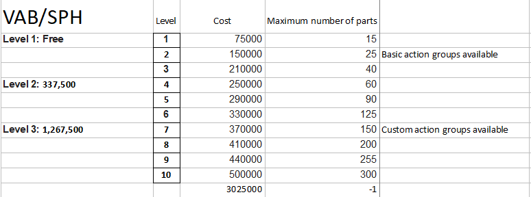
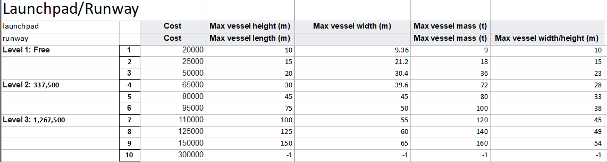
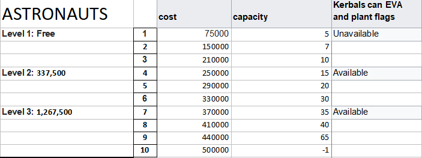
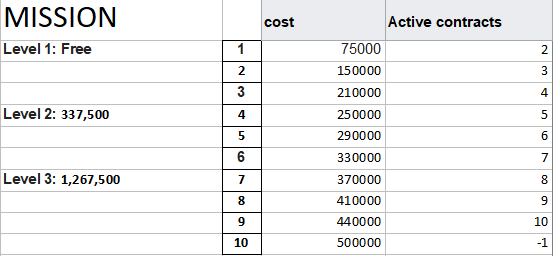
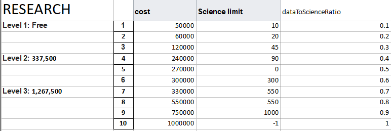
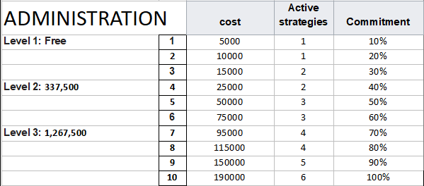

<!-- Readme.md v1.1.4.0
Komplexity ()
created: 01 Oct 18
updated: 10 May 2021 -->

## Download on [SpaceDock][MOD:spacedock] or [Github][MOD:github] or [Curseforge][MOD:curseforge]. Also available on [CKAN][MOD:ckan].  

# Komplexity for Custom Barn Kit ()
#### by zer0Kerbal
## KSC building levels spread out to 10 levels instead of 4
## by [@zer0Kerbal][LINK:zer0kerbal]  
![Mod Version][shield:mod:latest] 
![KSP version][shield:ksp] ![KSP-AVC][shield:kspavc] ![License GPLv2][shield:license] ![][LOGO:gplv2]   
![SpaceDock][shield:spacedock] ![CKAN][shield:ckan] ![GitHub][shield:github] ![Curseforge][shield:curseforge]  
![Code][shield:code] ![Validate AVC .version files][shield:avcvalid]  
***
![Komplexity][IMG:hero:0]
### Preamble 
> After playing KSP for a while, I wanted a tad more granularity to the building upgrades at the Kerbal Space Center. 4 levels (initial + three upgrades) just seemed to basic, and very unKerbalistic. So sat down with Bill and added some Komplexity and moar levels! yes, now there are a total of ten level (initial plus nine upgrades) for every building in the KSC (except currently the tracking station). This mod depends on ModuleManager and CustomBarnKit by [@Sarbian][LINK:sarbian].  

  
  
  
  
Soil Samples available at level 4 R&D  
  
  

### Installation Directions:
- Use CKAN  
![][image:ckan][CKAN][MOD:ckan]
### Changelog Summary
- *See [ChangeLog][MOD:changelog] for full details of mod changes*
### Known Issues
- *See [Known Issues][MOD:issues] for full details of feature requests, and known issues*
### Dependencies
- [x]  [Kerbal Space Program][KSP:website] [![][shield:ksp]][KSP:website] ***may*** work on other versions ]/YMMV/
 - [x]  [Module Manager][thread:mm]  
 - [x]  [Custom Barn Kit][thread:CBK]  
### Recommends  
- [x]  [Kerbal Changelog][thread:kcl]  
- [x]  [Strategia][thread:stra]  
### Suggests
- [x]  [On Demand Fuel Cells {ODFC)}][thread:ODFC]  
- [x]  [Field Training Facility (FTF)][thread:FTF]  
- [x]  [Field Training Lab (FTL)][thread:FTL]  
- [x]  [Docking Port Descriptions(DPD)][thread:DPD]  
- [x]  [PicoPort Shielded (PPS)][thread:PPS]  
- [x]  [Stork Delivery System (SDS)][thread:SDS]
- [x]  [Biomatic][thread:BIO]
- [x]  [B9 Stock Switches (BSS)]() 
- [x]  [DaMichel's AeroRadial][thread:DAR]  
- [x]  [DaMichel's CargoBays][thread:DCB]  
- [x]  [DaMichel's Fuselage][thread:DMF]  
- [x]  [DaMichel's Spherical Tanks][thread:DST]  
- [x]  [Stork Delivery System (SDS)][thread:SDS]  
- [x]  [SimpleConstructon!][thread:SC!]  
- [x]  [Not So SimpleConstructon!][thread:NSSC]   
- [x]  [SimpleLife!][thread:SL!]  
- [x]  [MoarKerbals][thread:MK]  
- [x]  [KaboOom!][thread:BOOM]    
### Supports
- [x]  [Kerbal Changelog][thread:kcl]
### Conflicts
- [x]  [SETI-CustomBarnKit][thread:cbkseti]  
- [x]  [Custom Barn Kit - RO build][thread:cbkro]  
***  
*red box below is a link to forum post on how to get support*  
[![How to get support][image:get-support]][thread:getsupport]

### License
#### aka Legal Mumbo Jumbo
Source: [GitHub][MOD:github:repo]  
License: ![License GPLv2][shield:license] ![][LOGO:gplv2]	
> *** All bundled mods are distributed under their own licenses***  
> *** All art assets (textures, models, animations) are distributed under their own licenses***   
### Original
Author: [@zer0Kerbal][LINK:zer0kerbal]   
[Thread][MOD:original:thread]  
[Download][MOD:original:download]  
Source: [GitHub][MOD:original:source]  
License: ![License GPLv2][shield:license:original] ![][LOGO:gplv2] 

<!-- graphical links to downloads -->
[![][image:github]][MOD:github] [![][image:spacedock]][MOD:spacedock] [![][image:curseforge]][MOD:curseforge]  

*Be Kind: Lithobrake, not jakebrake! Keep your Module Manager up to date*

###### v0.9.0.0 original: 01 Oct 2010 zed'K | updated: 10 May 2021 zed'K

[MOD:license]:	  https://github.com/zer0Kerbal/Komplexity/blob/master/LICENSE
[MOD:contributing]: https://github.com/zer0Kerbal/Komplexity/blob/master/.github/CONTRIBUTING.md
[MOD:wiki]:		 https://github.com/zer0Kerbal/Komplexity/
[MOD:issues]:	   https://github.com/zer0Kerbal/Komplexity/issues
[MOD:known]:		https://github.com/zer0Kerbal/Komplexity/wiki/Known-Issues
[MOD:forum]:		https://forum.kerbalspaceprogram.com/index.php?/topic/192456-*
[MOD:github:repo]:  https://github.com/zer0Kerbal/Komplexity/
[MOD:changelog]:	https://github.com/zer0Kerbal/Komplexity/Changelog.cfg
[KSP:website]:	  https://kerbalspaceprogram.com/ "Kerbal Space Program"  

<!--- original mod stuff -->
[MOD:original:source]:	 https://github.com/dboi88/CSI-Cargo-Freighter
[MOD:original:thread]:	 https://forum.kerbalspaceprogram.com/index.php?/topic/159615-*
[MOD:original:download]:   https://spacedock.info/mod/1332/
[shield:license:original]: https://img.shields.io/badge/License-WTFPL-red?backgroud=black?style=plastic "WTFPL"

<!--- license logo urls -->
[LOGO:gplv2]: https://i.postimg.cc/9FrwMgK6/GPL-17x17.png "GPLv2"  
[MOD:original:license:shield]:   https://i.postimg.cc/9FrwMgK6/GPL-17x17.png "GPLv2"   

[MOD:ckan]:	  https://forum.kerbalspaceprogram.com/index.php?/topic/90246-* "CKAN"  
[MOD:github]:	https://github.com/zer0Kerbal/Komplexity/releases/latest "GitHub"  
[MOD:spacedock]: https://spacedock.info/mod/1332 "SpaceDock"  
[MOD:curseforge]: https://www.curseforge.com/kerbal/ksp-mods/Komplexity "CurseForge"  

[image:github]:	 https://i.imgur.com/RE4Ppr9.png
[image:spacedock]:  https://i.imgur.com/m0a7tn2.png
[image:curseforge]: https://i.postimg.cc/RZNyB5vP/Download-On-Curse.png
[image:get-support]:	https://i.postimg.cc/vHP6zmrw/image.png

[image:ckan]:  https://i.postimg.cc/x8XSVg4R/sj507JC.png

[mage:github-sm]:	  https://i.postimg.cc/1XXy5yfD/github.png
[image:spacedock-sm]:  https://i.postimg.cc/DZ22Hrhj/spacedock.png
[image:curseforge-sm]: https://i.postimg.cc/ZRVTSWKT/UVVt0OP.png
  
[shield:mod:latest]: https://img.shields.io/github/v/release/zer0Kerbal/Komplexity?include_prereleases?style=plastic
[shield:mod]: https://img.shields.io/endpoint?url=https://raw.githubusercontent.com/zer0Kerbal/Komplexity/master/json/mod.json
[shield:ksp]: https://img.shields.io/endpoint?url=https://raw.githubusercontent.com/zer0Kerbal/Komplexity/master/json/ksp.json
[shield:license]: https://img.shields.io/endpoint?url=https://raw.githubusercontent.com/zer0Kerbal/Komplexity/master/json/license.json
[shield:code]: https://img.shields.io/endpoint?url=https://raw.githubusercontent.com/zer0Kerbal/Komplexity/master/json/code.json
[shield:kspavc]:	 https://img.shields.io/badge/KSP-AVC--supported-brightgreen.svg?style=plastic
[shield:spacedock]:  https://img.shields.io/badge/SpaceDock-listed-blue.svg?style=plastic
[shield:ckan]:	   https://img.shields.io/badge/CKAN-Indexed-blue.svg?style=plastic
[shield:github]:	 https://img.shields.io/badge/Github-Indexed-blue.svg?style=plastic&logo=github
[shield:curseforge]: https://img.shields.io/badge/CurseForge-listed-blue.svg?style=plastic
[shield:avcvalid]:	https://github.com/zer0Kerbal/Komplexity/workflows/Validate%20AVC%20.version%20files/badge.svg  

<!-- zer0Kerbal mods -->
[thread:ODFC]: https://forum.kerbalspaceprogram.com/index.php?/topic/187625-* "On Demand Fuel Cells"  
[thread:FTF]:  https://forum.kerbalspaceprogram.com/index.php?/topic/188841-* "Field Training Facility"  
[thread:FTL]:  https://forum.kerbalspaceprogram.com/index.php?/topic/188841-* "Field Training Lab"  
[thread:DPD]:  https://forum.kerbalspaceprogram.com/index.php?/topic/192184-* "Docking Port Descriptions"
[thread:PPS]:  https://forum.kerbalspaceprogram.com/index.php?/topic/192187-* "Shielded PicoPort"  
[thread:DST]:  https://forum.kerbalspaceprogram.com/index.php?/topic/191719-* "DaMichel's Spherical Tanks"  
[thread:DMF]:  https://forum.kerbalspaceprogram.com/index.php?/topic/191719-* "DaMichel's Fuselage"  
[thread:DAR]:  https://forum.kerbalspaceprogram.com/index.php?/topic/191719-* "DaMichel's AeroRadial"  
[thread:DCB]:  https://forum.kerbalspaceprogram.com/index.php?/topic/191719-* "DaMichel's CargoBays"  
[thread:SDS]:  https://forum.kerbalspaceprogram.com/index.php?/topic/191719-* "Stork Delivery System (SDS)"	
[thread:BIO]:  https://forum.kerbalspaceprogram.com/index.php?/topic/191426-* "Biomatic"  
[thread:B9S]:  https://forum.kerbalspaceprogram.com/index.php?/topic/190870-* "B9 Stock Patches"   
[thread:KGX]:  https://forum.kerbalspaceprogram.com/index.php?/topic/192696-* "KerGuise Experimental Engineering"  
[thread:SC!]:  https://forum.kerbalspaceprogram.com/index.php?/topic/191424-* "SimpleConstructon!"  
[thread:SL!]:  https://forum.kerbalspaceprogram.com/index.php?/topic/191045-* "SimpleLogistics!"  
[thread:NSSC]:  https://forum.kerbalspaceprogram.com/index.php?/topic/191504-* "Not So SimpleConstructon!"  
[thread:BOOM]: https://forum.kerbalspaceprogram.com/index.php?/topic/192938-* "KaboOom!"
[thread:SL!]:  https:// "SimpleLife!"  
[thread:MK]:  https:// "MoarKerbals"  
 

[thread:mm]:  https://forum.kerbalspaceprogram.com/index.php?/topic/50533-* "Module Manager"   
[thread:kcl]: https://forum.kerbalspaceprogram.com/index.php?/topic/179207-* "Kerbal Changelog"    
[thread:cbkseti]: https://forum.kerbalspaceprogram.com/index.php?/topic/95645-* "SETI CBK"  
[thread:cbkro]: https://forum.kerbalspaceprogram.com/index.php?/topic/109027-* "Custom Barn Kit - RO build"  
[thread:CBK]: https://forum.kerbalspaceprogram.com/index.php?/topic/109027-* "Custom Barn Kit"  
[thread:Stra]: http://forum.kerbalspaceprogram.com/index.php?/topic/131808-* "Strategia"  

[thread:getsupport]: https://forum.kerbalspaceprogram.com/index.php?/topic/83212-* "Link to how to get support"  

[LINK:zer0Kerbal]:	 https://forum.kerbalspaceprogram.com/index.php?/profile/190933-zer0kerbal/ "zed'K"  
[LINK:sarbian]: https://forum.kerbalspaceprogram.com/index.php?/profile/57146-sarbian/ "Sarbian"  

[IMG:hero:0]: https://i.imgur.com/DVDdgU1.png
[IMG:hero:1]: https://i.imgur.com/y0vd6WS.png

<!--
this file: GPLv2
zer0Kerbal-->
