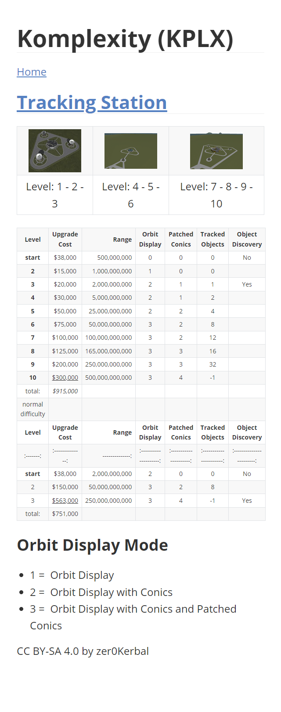

<!-- Tracking.md v2.1.0.0
Komplexity (KPLX)
created: 05 Nov 2019
updated: 22 Jul 2022

this file: CC-BY-SA 4.0 by zer0Kerbal -->

<i class="fa-solid fa-file-contract fa-beat-fade fa-3x" style="--fa-beat-fade-opacity: 0.1; --fa-beat-fade-scale: 1.25;color: #6495ED" ></i>

# Komplexity (KPLX)

[Home](./index.md)

## [Tracking Station](https://wiki.kerbalspaceprogram.com/wiki/Tracking_Station)

|  |  |  |
| :---------------------------------------------------------------------------------------------------------------------: | :--------------------------------------------------------------------------------------------------------------------------------: | :--------------------------------------------------------------------------------------------------------------------------------: |
|                                                    Level: 1 - 2 - 3                                                     |                                                          Level: 4 - 5 - 6                                                          |                                                       Level: 7 - 8 - 9 - 10                                                        |

| **Level** | **Upgrade Cost** |       **Range** | **Orbit Display** | **Patched Conics** | **Tracked Objects** | **Object Discovery** |
| :-------: | :--------------: | --------------: | :--------------------: | :---------------------: | :----------------------: | :-----------------------: |
| **start** |     $38,000      |     500,000,000 |           0            |            0            |            0             |            No             |
|   **2**   |     $15,000      |   1,000,000,000 |           1            |            0            |            0             |                           |
|   **3**   |     $20,000      |   2,000,000,000 |           2            |            1            |            1             |            Yes            |
|   **4**   |     $30,000      |   5,000,000,000 |           2            |            1            |            2             |                           |
|   **5**   |     $50,000      |  25,000,000,000 |           2            |            2            |            4             |                           |
|   **6**   |     $75,000      |  50,000,000,000 |           3            |            2            |            8             |                           |
|   **7**   |     $100,000     | 100,000,000,000 |           3            |            2            |            12            |                           |
|   **8**   |     $125,000     | 165,000,000,000 |           3            |            3            |            16            |                           |
|   **9**   |     $200,000     | 250,000,000,000 |           3            |            3            |            32            |                           |
|  **10**   | <u>$300,000</u>  | 500,000,000,000 |           3            |            4            |            -1            |                           |
|  total:   |    *$915,000*    |                 |                        |                         |                          |                           |
normal difficulty
| **Level** | **Upgrade Cost** |       **Range** | **Orbit Display** | **Patched Conics** | **Tracked Objects** | **Object Discovery** |
| :-------: | :--------------: | --------------: | :--------------------: | :---------------------: | :----------------------: | :-----------------------: |
| **start** |     $38,000      |   2,000,000,000 |           2            |            0            |            0             |            No             |
|     2     |     $150,000     |  50,000,000,000 |           3            |            2            |            8             |                           |
|     3     | <u>$563,000</u>  | 250,000,000,000 |           3            |            4            |            -1            |            Yes            |
|  total:   |     $751,000     |                 |                        |                         |                          |                           |

### Orbit Display Mode

* 1 =  Orbit Display
* 2 =  Orbit Display with Conics
* 3 =  Orbit Display with Conics and Patched Conics

  
 Image Version

  
 

